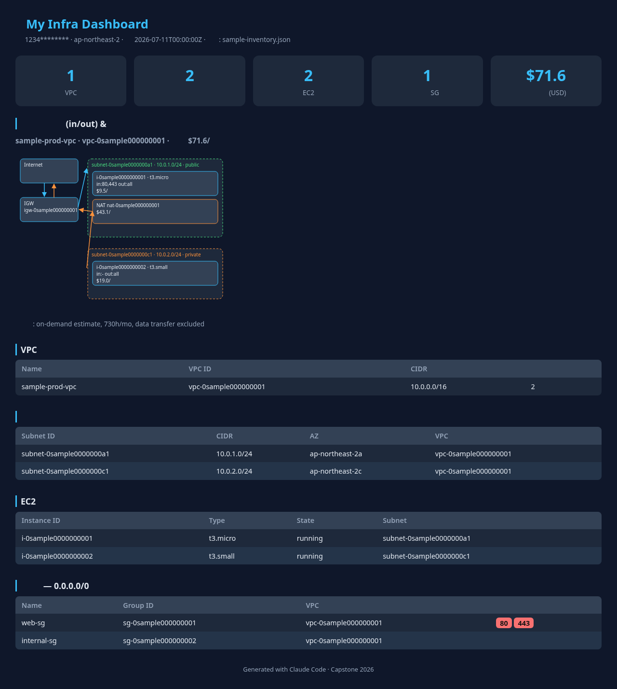

# My Infra Dashboard

<a href="#english"></a>
<a href="#korean"></a>
[]()
[](https://claude.com/claude-code)

A Claude Code workshop capstone that scans your AWS account read-only and publishes a single-file infrastructure dashboard — topology, open ports, and cost estimates — to S3 + CloudFront. | AWS 계정을 읽기 전용으로 스캔해 토폴로지·오픈 포트·비용 추정이 담긴 단일 파일 대시보드를 S3 + CloudFront로 배포하는 Claude Code 워크샵 캡스톤입니다.

---

<a id="english"></a>

# English

## Overview

My Infra Dashboard is a 2-hour capstone project for the Claude Code Deep Dive Workshop, designed for infrastructure and network engineers. Driving Claude Code with a custom subagent and skill, participants scan their own AWS account (VPCs, subnets, security groups, EC2, IGW/NAT, route tables), estimate monthly costs via the Pricing API, and deploy the resulting dashboard behind CloudFront — no backend, no JavaScript, one HTML file.



The project is built in three sequential modules, each with its own spec and step-by-step implementation plan. The committed code and screenshot reflect the final state after all three.

| Module | Plan | What it adds |
|--------|------|--------------|
| 1. Base dashboard | [2026-07-11-my-infra-dashboard.md](docs/superpowers/plans/2026-07-11-my-infra-dashboard.md) | Read-only scan, HTML dashboard, S3 + CloudFront (OAC) deployment |
| 2. Topology + cost | [2026-07-11-topology-cost-extension.md](docs/superpowers/plans/2026-07-11-topology-cost-extension.md) | Per-VPC in/out SVG diagrams, Pricing API monthly estimates |
| 3. UI restyle | [2026-07-12-ui-restyle.md](docs/superpowers/plans/2026-07-12-ui-restyle.md) | Dark theme, donut summary cards, collapsible VPC sections, pill badges |

## Features

- **Read-only account scan** — `scan.sh` collects VPCs, subnets, security groups, EC2, IGW/NAT, and route tables with `describe-*` calls only, and derives public/private/isolated routing per subnet
- **Cost estimation** — on-demand unit prices from the AWS Pricing API (730 h/month), per-node badges plus per-VPC and account totals, with graceful `$—` fallback when pricing is unavailable
- **Self-contained dashboard** — a single `index.html` with inline CSS/SVG and zero JavaScript; topology diagrams, donut charts, and collapsible sections all render without external resources
- **Claude Code assets** — an `infra-scanner` subagent, a `dashboard-builder` skill, and a read-only permission allowlist, exercising the workshop's agent/skill/settings chapters
- **One-template deployment** — CloudFormation stack with a private S3 bucket behind CloudFront Origin Access Control
- **Privacy defaults** — account ID masked by default (`MASK_ACCOUNT=false` to disable); the committed screenshot contains sample data only

## Prerequisites

- AWS CLI v2 with credentials configured
- `jq` and Python 3 (standard library only)
- [Claude Code](https://claude.com/claude-code) (to use the subagent and skill)
- IAM permissions: `ec2:Describe*`, `pricing:GetProducts`, and CloudFormation/S3/CloudFront permissions for deployment

## Installation

```bash
# Clone the repository
git clone https://github.com/comeddy/capstone-infra-dashboard.git
cd capstone-infra-dashboard/capstone/my-infra-dashboard
```

## Usage

```bash
# 1. Scan the account (read-only) -> data/inventory.json
AWS_REGION=ap-northeast-2 bash scripts/scan.sh
# OK: data/inventory.json (5 VPCs, 4 EC2, 3 NAT)

# 2. Build the dashboard -> site/index.html
python3 scripts/build_dashboard.py
# OK: .../site/index.html 생성 (source=inventory.json)

# 3. Deploy the hosting stack (once)
aws cloudformation deploy --template-file infra/stack.yaml \
  --stack-name my-infra-dashboard --region ap-northeast-2

# 4. Upload and open the CloudFront URL
BUCKET=$(aws cloudformation describe-stacks --stack-name my-infra-dashboard \
  --query "Stacks[0].Outputs[?OutputKey=='BucketName'].OutputValue" --output text)
aws s3 sync site/ "s3://$BUCKET"
```

Inside Claude Code, the same flow is conversational: "계정 스캔해줘" triggers the `infra-scanner` subagent and "대시보드 갱신해줘" triggers the `dashboard-builder` skill.

Without AWS credentials, the builder falls back to `data/sample-inventory.json`, so the dashboard can be previewed locally.

**Security note:** the deployed dashboard is publicly reachable and shows your account's routing structure, open ports, and cost estimates. Delete the stack after your demo (empty the bucket, then `aws cloudformation delete-stack --stack-name my-infra-dashboard`).

## Configuration

| Variable | Description | Default |
|----------|-------------|---------|
| `AWS_REGION` | Region to scan and deploy | `ap-northeast-2` |
| `MASK_ACCOUNT` | Mask the account ID in the dashboard | `true` |

## Project Structure

```
capstone-infra-dashboard/
  capstone/my-infra-dashboard/
    scripts/scan.sh              # Read-only AWS scan -> data/inventory.json
    scripts/build_dashboard.py   # inventory.json -> site/index.html (single file)
    infra/stack.yaml             # S3 + CloudFront (OAC) CloudFormation
    infra/sample-vpc.yaml        # Sample VPC for empty accounts
    data/sample-inventory.json   # Fallback data (no credentials needed)
    .claude/agents/              # infra-scanner subagent
    .claude/skills/              # dashboard-builder skill
    docs/final-screenshot.png    # Sample-data screenshot
  docs/superpowers/specs/        # Design specs (3 modules)
  docs/superpowers/plans/        # Step-by-step implementation plans (3 modules)
```

## Contributing

```
1. Fork the repository
2. Create your branch (git checkout -b feat/amazing-feature)
3. Commit changes (git commit -m 'feat: add amazing feature')
4. Push to the branch (git push origin feat/amazing-feature)
5. Open a Pull Request
```

## License

No license has been specified yet. Contact the maintainer before reusing this material.

## Contact

- Maintainer: [comeddy](https://github.com/comeddy)
- Issues: [GitHub Issues](https://github.com/comeddy/capstone-infra-dashboard/issues)

---

<a id="korean"></a>

# 한국어

## 개요

My Infra Dashboard는 인프라·네트워크 엔지니어를 위한 Claude Code Deep Dive Workshop의 2시간 캡스톤 프로젝트입니다. 참가자는 커스텀 서브에이전트와 스킬로 Claude Code를 지휘해 자신의 AWS 계정(VPC, 서브넷, 보안그룹, EC2, IGW/NAT, 라우트 테이블)을 스캔하고, Pricing API로 월 비용을 추정한 뒤, 결과 대시보드를 CloudFront 뒤에 배포합니다. 백엔드 없음, JavaScript 없음, HTML 파일 하나로 완결됩니다.


프로젝트는 순차적인 3개 모듈로 구성되며, 각 모듈은 자체 스펙과 단계별 실습 가이드를 갖습니다. 커밋된 코드와 스크린샷은 3개 모듈을 모두 적용한 최종 상태입니다.

| 모듈 | 실습 가이드 | 추가되는 것 |
|------|------|--------------|
| 1. 기본 대시보드 | [2026-07-11-my-infra-dashboard.md](docs/superpowers/plans/2026-07-11-my-infra-dashboard.md) | 읽기 전용 스캔, HTML 대시보드, S3 + CloudFront(OAC) 배포 |
| 2. 토폴로지 + 비용 | [2026-07-11-topology-cost-extension.md](docs/superpowers/plans/2026-07-11-topology-cost-extension.md) | VPC별 in/out SVG 다이어그램, Pricing API 월 비용 추정 |
| 3. UI 리스타일 | [2026-07-12-ui-restyle.md](docs/superpowers/plans/2026-07-12-ui-restyle.md) | 다크 테마, 도넛 요약 카드, 접이식 VPC 섹션, pill 배지 |

## 주요 기능

- **읽기 전용 계정 스캔** — `scan.sh`가 `describe-*` 호출만으로 VPC, 서브넷, 보안그룹, EC2, IGW/NAT, 라우트 테이블을 수집하고 서브넷별 public/private/isolated 라우팅을 판정합니다
- **비용 추정** — AWS Pricing API의 온디맨드 단가(월 730시간 기준)로 노드별 배지와 VPC별·계정 전체 합계를 표시하며, 단가 조회 실패 시 `$—`로 우아하게 표시합니다
- **자기 완결형 대시보드** — 인라인 CSS/SVG만 사용하고 JavaScript가 없는 단일 `index.html`. 토폴로지 다이어그램, 도넛 차트, 접이식 섹션이 외부 리소스 없이 렌더링됩니다
- **Claude Code 자산** — `infra-scanner` 서브에이전트, `dashboard-builder` 스킬, 읽기 전용 권한 allowlist로 워크샵의 에이전트/스킬/설정 챕터를 실습합니다
- **템플릿 한 장 배포** — CloudFront Origin Access Control 뒤의 비공개 S3 버킷으로 구성된 CloudFormation 스택
- **프라이버시 기본값** — 계정 ID는 기본 마스킹(`MASK_ACCOUNT=false`로 해제)되며, 커밋된 스크린샷은 샘플 데이터만 포함합니다

## 사전 요구 사항

- 자격 증명이 구성된 AWS CLI v2
- `jq`, Python 3 (표준 라이브러리만 사용)
- [Claude Code](https://claude.com/claude-code) (서브에이전트·스킬 사용 시)
- IAM 권한: `ec2:Describe*`, `pricing:GetProducts`, 배포용 CloudFormation/S3/CloudFront 권한

## 설치 방법

```bash
# 리포지토리 클론
git clone https://github.com/comeddy/capstone-infra-dashboard.git
cd capstone-infra-dashboard/capstone/my-infra-dashboard
```

## 사용법

```bash
# 1. 계정 스캔 (읽기 전용) -> data/inventory.json
AWS_REGION=ap-northeast-2 bash scripts/scan.sh
# OK: data/inventory.json (5 VPCs, 4 EC2, 3 NAT)

# 2. 대시보드 생성 -> site/index.html
python3 scripts/build_dashboard.py
# OK: .../site/index.html 생성 (source=inventory.json)

# 3. 호스팅 스택 배포 (최초 1회)
aws cloudformation deploy --template-file infra/stack.yaml \
  --stack-name my-infra-dashboard --region ap-northeast-2

# 4. 업로드 후 CloudFront URL 접속
BUCKET=$(aws cloudformation describe-stacks --stack-name my-infra-dashboard \
  --query "Stacks[0].Outputs[?OutputKey=='BucketName'].OutputValue" --output text)
aws s3 sync site/ "s3://$BUCKET"
```

Claude Code 안에서는 같은 흐름이 대화형으로 동작합니다. "계정 스캔해줘"는 `infra-scanner` 서브에이전트를, "대시보드 갱신해줘"는 `dashboard-builder` 스킬을 트리거합니다.

AWS 자격 증명이 없으면 빌더가 `data/sample-inventory.json`으로 폴백하므로 로컬에서 대시보드를 미리 볼 수 있습니다.

**보안 주의:** 배포된 대시보드는 인증 없이 공개되며 계정의 라우팅 구조, 오픈 포트, 비용 추정을 노출합니다. 데모 후에는 반드시 스택을 정리합니다 (버킷 비우기 후 `aws cloudformation delete-stack --stack-name my-infra-dashboard`).

## 환경 설정

| 변수 | 설명 | 기본값 |
|----------|-------------|---------|
| `AWS_REGION` | 스캔·배포 리전 | `ap-northeast-2` |
| `MASK_ACCOUNT` | 대시보드의 계정 ID 마스킹 여부 | `true` |

## 프로젝트 구조

```
capstone-infra-dashboard/
  capstone/my-infra-dashboard/
    scripts/scan.sh              # 읽기 전용 AWS 스캔 -> data/inventory.json
    scripts/build_dashboard.py   # inventory.json -> site/index.html (단일 파일)
    infra/stack.yaml             # S3 + CloudFront(OAC) CloudFormation
    infra/sample-vpc.yaml        # 빈 계정용 샘플 VPC
    data/sample-inventory.json   # 폴백 데이터 (자격 증명 불필요)
    .claude/agents/              # infra-scanner 서브에이전트
    .claude/skills/              # dashboard-builder 스킬
    docs/final-screenshot.png    # 샘플 데이터 스크린샷
  docs/superpowers/specs/        # 설계 스펙 (3개 모듈)
  docs/superpowers/plans/        # 단계별 실습 가이드 (3개 모듈)
```

## 기여 방법

```
1. 리포지토리를 Fork 합니다
2. 브랜치를 생성합니다 (git checkout -b feat/amazing-feature)
3. 변경 사항을 커밋합니다 (git commit -m 'feat: add amazing feature')
4. 브랜치에 Push 합니다 (git push origin feat/amazing-feature)
5. Pull Request를 엽니다
```

## 라이선스

라이선스가 아직 지정되지 않았습니다. 자료를 재사용하려면 유지 관리자에게 문의해 주세요.

## 연락처

- 유지 관리자: [comeddy](https://github.com/comeddy)
- 이슈: [GitHub Issues](https://github.com/comeddy/capstone-infra-dashboard/issues)
